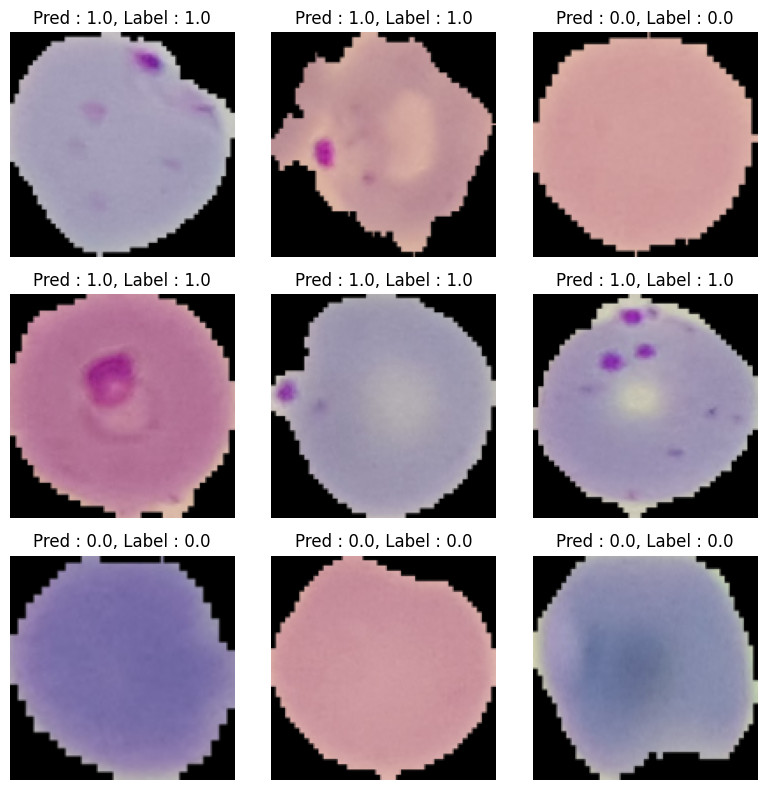

# ResNet모델을 활용한 Malaria 감염 검출


## 🔹 프로젝트 구조

```
datasets/
    cell_images/
        Parasitized/
        Uninfected/
    malaria_dataset.py
models/
    custom_resnet.py
utils/
    data_utils.py
    train.py
    test.py
    transforms.py
    unzip.py
    visualize.py
main.py
requirements.txt
Dockerfile
```
---
## 🔹 실행법 (for Local PC)

### ☝️ Requirements 설치

```
pip install -r requirements.txt
```

### ✌️ 실행

```
python main.py
```
---
## 🔹 도커 실행법 (for Docker User)

### ☝️ 도커 이미지 빌드

```
docker build -t malaria-resnet-classifier .
```

### ✌️ 컨테이너 실행

```
docker run --rm malaria-resnet-classifier
```

---

## 🔹 데이터셋

Malaria Cell Images Dataset  
Malaria Cell Images Dataset은 말라리아 감염 여부를 판별하기 위한 세포 이미지 데이터셋으로, 총 27,558장의 이미지로 구성되어있습니다. 각 이미지는 감염된 세포(Parasitized)와 비감염 세포(Uninfected)로 구분되어 있으며, 이진 분류 모델에 적합합니다.  
  
해당 작업물에는 `datasets/cell_images` 폴더에 **샘플 이미지**만 포함되어 있습니다.  
전체 데이터셋은 아래 Kaggle 링크를 통해 직접 다운로드해 주세요.  
🔗 https://www.kaggle.com/datasets/iarunava/cell-images-for-detecting-malaria

---

## 🔹 결과

20회 에포크 학습 후, 정확도:

```
Test Accuracy: 96.21%
```

예측 결과 예시:



---
📄 [Project Details](https://portfolio-unoh.site/work2)
06unoh